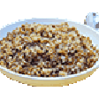

# Grecha-Susha.js



Dead-Simple Front-End JavaScript Framework. 
Originally designed for [emoteJAM](https://github.com/tsoding/emoteJAM).

Derived into a more complete framework by [Spectcow](https://spcfork.replit.app).

The name basically means [buckwheat](https://en.wikipedia.org/wiki/Buckwheat) and [land](https://en.wikipedia.org/wiki/land) in russian.

---

> ### *Make sure you only download official versions of G-Susha from here.*
> *I don't own these mirrors, and are likely to have anything unwanted in them.*

> *Please only refer to emails listed on my profile here, or [https://spcfork.replit.app](https://spcfork.replit.app).*
>
> *You can get the latest Susha from this Github, the [website](https://sushajs.replit.app/), or even the [Asri Source code](https://asridev.replit.app/), which has a static/stable version.*

> ***I am not liable for damages caused by outside 3rd-Party mirrors.***
> ***The Source Code/License allows for usage like this, but it is not reccomended to use these mirrors.***

---

## Quick Start

https://sushajs.replit.app/examples

### noModule Setup
Here's how to start in noModule version.

```html
<!DOCTYPE html>
<html>

<head>
  <title>Grecha-Susha.js</title>
  <script src="./grecha-sushsa.js"></script>
</head>

<body>
  <div id="entry"></div>
  <script>
    const kasha = img("Kasha.png");
    const kashaHard = img("KashaHard.gif");

    const r = router({
      "/": (r) => {
        const [count, setCount] = r.useState(0);
        const [hard, setHard] = r.useState(false);

        return div(
          h1("Grecha.js"),
          
          div(a("Foo").att$("href", "#/foo")),
          div(a("Bar").att$("href", "#/bar")),
          
          div(`Counter: ${count()}`),
          
          div(hard() ? kashaHard : kasha).onclick$(() => {
            setCount(count() + 1);
            setHard(!hard());
          }),
        )
      },
      
      "/foo": () => div(
        h1("Foo"),
        
        p(LOREM),
        
        div(a("Home").att$("href", "#")),
      ),
      
      "/bar": () => div(
        h1("Bar"),
        
        p(LOREM),
        
        div(a("Home").att$("href", "#"))
      )
      
    });
    
    entry.appendChild(r);
    
  </script>
</body>

</html>
```

### Module Setup

Here's how to start in a Module version for modern conventions.

```html
<!DOCTYPE html>
<html>

<head>
  <title>Grecha-Susha.js</title>
  <script src="./grecha-susha.module.js" type="module"></script>

</head>

<body>
  <div id="entry"></div>

  <script type="module">

    const kasha = img("Kasha.png");
    const kashaHard = img("KashaHard.gif");

    const r = router({

      "/": (r) => {
        const [count, setCount] = r.useState(0);
        const [hard, setHard] = r.useState(false);

        // setCount(0)
        // setHard(false)

        return div(
          h1("Grecha.js"),

          div(a("Foo").att$("href", "#/foo")),
          div(a("Bar").att$("href", "#/bar")),

          div(`Counter: ${count()}`),

          div(hard() ? kashaHard : kasha).onclick$(() => {
            setCount(count() + 1);
            setHard(!hard());
          }),
        )
      },

      "/foo": () => div(
        h1("Foo"),
        p(LOREM),
        div(a("Home").att$("href", "#")),
      ),

      "/bar": () => div(
        h1("Bar"),
        p(LOREM),
        div(a("Home").att$("href", "#"))
      ),

      // Working 404
      '/404': () => div(
        h1("404"),
        p("You've hit an error page!!"),
        div(a("Home").att$("href", "#"))
      )

    });
    
    entry.appendChild(r);

  </script>
  <!-- <script src="./grecha-susha.imports.js"></script> -->

</body>

</html>
```
